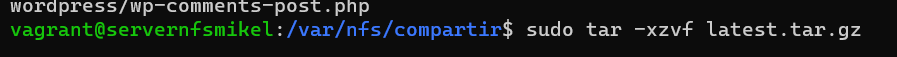

# Pila-LEMP

# Indice

1. [Indice.](#Indice)
2. [Introducción.](#introducción)
3. [Creacion de servidores.](CREACION_DE_SERVIDORES) 
    * [Balanceador.](#Balanceador)
    * [Servidor NFS.](#NFSserver)
    * [Servidores web.](#Serverweb1y2)
    * [Servidor BBDD.](#GGBBserver)


# Introduccion

En esta práctica, se implementa una pila LEMP con la siguiente estructura:

Capa 1: Exposición a la red pública. Se utiliza una máquina con un balanceador de carga Nginx.

Capa 2: Backend.

Dos máquinas con un servidor web Nginx cada una.
Una máquina que aloja un servidor NFS y el motor PHP-FPM.

Capa 3: Datos. Se emplea una base de datos MariaDB.

Es importante destacar que las capas 2 y 3 no estarán accesibles desde la red pública. Los servidores web utilizarán una carpeta compartida proporcionada por NFS desde el servidor NFS. Además, emplearán el motor PHP-FPM instalado en la misma máquina que el servidor NFS.

# CREACION DE SERVIDORES.

# Balanceador

Para la configuración del balanceador, utilizaremos un proceso de aprovisionamiento que permitirá ahorrar tiempo y esfuerzo. Este proceso incluirá la instalación de Nginx, su inicio y la eliminación de archivos innecesarios.

 ```
sudo apt update
sudo apt install -y nginx
systenctl start nginx
systemmctl enable nginx

 ```

Una vez iniciada la máquina, accederemos al directorio **/etc/nginx/sites-enabled** y crearemos un archivo llamado "balanceador". En este archivo, añadiremos el siguiente código:
 ```
upstream servidoresweb {
    server (direccion IP de servidor web1)
    server (direccion IP de servidor web2)
}
	
server {
    listen      80;
    server_name balanceador;

    location / {
	    proxy_redirect      off;
	    proxy_set_header    X-Real-IP \$remote_addr;
	    proxy_set_header    X-Forwarded-For \$proxy_add_x_forwarded_for;
        proxy_set_header    Host \$http_host;
        proxy_pass          http://servidoresweb;
	}
}
 ```


 

 

# NFSserver
Para este servidor, llevaremos a cabo el siguiente aprovisionamiento para reducir el trabajo:

 

Una vez tengamos el servidor activo, crearemos el siguiente directorio.

 

Después, accederemos al archivo /etc/exports y añadiremos las siguientes dos líneas para permitir compartir la carpeta creada anteriormente.
```
/var/nfs/compartir     X.X.X.X(rw,sync,no_root_squash,no_subtree_check)
/var/nfs/compartir     X.X.X.X(rw,sync,no_root_squash,no_subtree_check)
```

 

 

Una vez editado el archivo, nos moveremos a /var/nfs/compartir y descargaremos el siguiente archivo de WordPress.

 

 

Ahora habilitaremos los puertos de los servidores para evitar problemas con NFS.

 

Seguidamente, en la carpeta en la que descargamos WordPress, editaremos el archivo **wp-config-sample** con los siguientes datos que utilizaremos para acceder a la base de datos.

 

 

 Ahora le asignaremos sus permisos y realizaremos las modificaciones correspondientes.

 

# Serverweb1y2

Para los servidores web, utilizaremos el siguiente aprovisionamiento:

 


Para montar el directorio anteriormente creado en el NFS, utilizaremos el siguiente comando:

```
sudo mount X.X.X.X:/var/nfs/compartida/wordpress /var/nfs/compartida/wordpress
```

 

 
 
Tras realizar el paso anterior, iremos al directorio **/etc/nginx/sites-available** y crearemos una copia del archivo "default".

 

La cual ahora se editará modificando las siguientes líneas.

 

 

 

Una vez editado el archivo, crearemos un enlace simbólico a otro directorio con el siguiente comando:
```
sudo ln -s /etc/nginx/sites-available/wordpress /etc/nginx/sites-enabled.
```

 

-----Nota-----
Si luego queremos conectarnos de forma remota al servidor de datos, debemos instalar mysql-client. Para esto, utilizaremos:
```
sudo apt install mysql-client
sudo mysql -h X.X.X.X -u mi_usuario -p
```

# GGBBserver

Este será el aprovisionamiento que se le dará al servidor de datos.


 

Una vez arranquemos la máquina, iremos al directorio **/etc/mysql** y editaremos el archivo "50-server", cambiando en la línea "bind-address" la dirección IP que está por defecto por la de nuestro servidor de datos.

Una vez realizado ese cambio, crearemos la base de datos, el usuario y se le darán los permisos correspondientes para el posterior acceso.

 


Para la comprobación, iremos a nuestro navegador en modo incógnito y escribiremos "localhost:9000" en mi caso, y deberá mostrarse una página como la siguiente.

 

Con esto, WordPress estaría instalado y solo faltaría continuar con su instalación desde la página web.
